# 🚀 Z-Agent: AI-Powered Web3 Coin Trading Platform

<div align="center">


**🤖 AI-Driven • 🚀 Production-Ready • 🌐 Web3 Native**

*Revolutionizing cryptocurrency trading with intelligent automation, real-time analytics, and seamless blockchain integration on Base Network.*

[🌐 Live Demo](https://z-agent.vercel.app) • [📖 Documentation](./docs/) • [🐛 Report Issues](https://github.com/cypherpulse/Z-AgentFrontend/issues)

</div>

---

## 📋 Table of Contents

- [✨ Overview](#-overview)
- [🎯 Key Features](#-key-features)
- [🏗️ System Architecture](#️-system-architecture)
- [🛠️ Technology Stack](#️-technology-stack)
- [🚀 Quick Start](#-quick-start)
- [📊 Core Components](#-core-components)
- [🔐 Authentication](#-authentication)
- [🤖 AI Integration](#-ai-integration)
- [📱 Responsive Design](#-responsive-design)
- [🔧 Development](#-development)
- [📚 Documentation](#-documentation)
- [🤝 Contributing](#-contributing)
- [📄 License](#-license)

---

## ✨ Overview

**Z-Agent** empowers degens, traders, and buyers on Zora with cutting-edge AI insights to make smarter decisions. Analyze coins, schedule trades, create tokens, and build winning watchlists with our intelligent platform.

### 🎯 What Makes Z-Agent Revolutionary

- **🧠 AI Coin Insights**: Get intelligent analysis and trading recommendations for any Zora coin through our advanced AI assistant. Make data-driven decisions with real-time market intelligence
- **⚡ Create & Schedule Coins**: Launch your own creator coins and schedule automated deployments. Perfect for timed releases and strategic market entries
- **⏰ Schedule Trades**: Automate your trading strategy with scheduled buy/sell orders. Execute trades at optimal times without constant monitoring
- **⭐ Smart Watchlists**: Build intelligent watchlists with AI-powered alerts and notifications. Never miss a trading opportunity on Zora
- **📊 Real-time Analytics**: Track coin performance, market trends, and holder statistics with our comprehensive analytics dashboard
- **� Secure Trading**: Trade with confidence using our secure wallet integration and advanced risk management tools

### 🌟 Empowering Zora Traders

We're revolutionizing trading on Zora by combining AI intelligence with blockchain technology. Our platform gives degens, traders, and buyers the tools they need to make smarter decisions, automate strategies, and stay ahead of the market with real-time insights and automated trading features.

---

## 🎯 Key Features

### 💰 Advanced Coin Management
- **Token Genesis Engine**: Create custom ERC-20 tokens with programmable economics and metadata
- **DEX Integration**: Seamless trading through automated market makers with optimized routing
- **Portfolio Intelligence**: AI-driven portfolio rebalancing and risk-adjusted position sizing
- **Automated Execution**: Set conditional orders and algorithmic trading strategies

### 🤖 Cognitive AI Analytics
- **Neural Market Analysis**: Deep learning models processing on-chain and off-chain data for comprehensive insights
- **Predictive Modeling**: Time-series forecasting using LSTM networks and ensemble methods
- **Risk Quantification**: Probabilistic risk assessment with Monte Carlo simulations
- **Conversational Intelligence**: Natural language processing for intuitive trading queries

### 🔐 Sovereign Security Architecture
- **Cryptographic Authentication**: Sign-In with Ethereum protocol ensuring user sovereignty
- **Zero-Knowledge Operations**: Privacy-preserving computations without compromising transparency
- **Multi-Signature Security**: Advanced wallet security with hardware wallet integration
- **Audit Trail Transparency**: Immutable transaction records with cryptographic verification

### 📊 Institutional-Grade Analytics
- **High-Frequency Charts**: Real-time candlestick charts with advanced technical indicators
- **On-Chain Intelligence**: Comprehensive blockchain analytics and whale tracking
- **Sentiment Analysis**: Social media and news sentiment processing with NLP models
- **Performance Attribution**: Detailed P&L analysis with risk-adjusted return metrics

---

## 🏗️ System Architecture

### 🏛️ High-Level Architecture

```mermaid
graph TB
    subgraph "🌐 User Layer"
        User[👤 User<br/>Web Browser]
        Mobile[📱 Mobile App<br/>Future]
    end

    subgraph "🎨 Frontend Layer"
        React[⚛️ React 18<br/>TypeScript]
        UI["🖥️ UI Components<br/>Shadcn/ui + Tailwind"]
        State["📊 State Management<br/>Zustand + TanStack Query"]
        Router["🛤️ Routing<br/>Wouter"]
    end

    subgraph "🔗 Blockchain Layer"
        Base[⛓️ Base Network<br/>Chain ID: 8453]
        Wallets[👛 Wallets<br/>MetaMask, WC, Coinbase]
        Contracts[📄 Smart Contracts<br/>ERC-20, ERC-721]
    end

    subgraph "🤖 AI Layer"
        OpenAI[🧠 OpenAI API<br/>GPT-4, GPT-3.5]
        Analysis[📈 Market Analysis<br/>Price Prediction]
        Chat[💬 Conversational AI<br/>Trading Assistant]
    end

    subgraph "🗄️ Data Layer"
        API[🔌 REST API<br/>Express.js]
        Database[(💾 PostgreSQL<br/>Trading Data)]
        Cache[⚡ Redis<br/>Session Cache]
        IPFS[📦 IPFS<br/>Metadata Storage]
    end

    subgraph "☁️ Infrastructure"
        Vercel[▲ Vercel<br/>Frontend Hosting]
        Railway[🚂 Railway<br/>Backend Hosting]
        Cloudinary[☁️ Cloudinary<br/>Image Storage]
    end

    %% Data Flow
    User --> React
    Mobile --> React
    React --> State
    React --> Router
    React --> UI

    React -->|Wallet Connect| Wallets
    Wallets -->|SIWE Auth| Base
    React -->|API Calls| API
    API --> Database
    API --> Cache
    React -->|AI Queries| OpenAI
    OpenAI --> Analysis
    OpenAI --> Chat

    Contracts --> Base
    React -->|Metadata| IPFS

    React --> Vercel
    API --> Railway
    UI --> Cloudinary

    %% Styling
    classDef userLayer fill:#e3f2fd,stroke:#1976d2,stroke-width:2px,color:#0d47a1
    classDef frontend fill:#f3e5f5,stroke:#7b1fa2,stroke-width:2px,color:#4a148c
    classDef blockchain fill:#e8f5e8,stroke:#388e3c,stroke-width:2px,color:#1b5e20
    classDef ai fill:#fff3e0,stroke:#f57c00,stroke-width:2px,color:#bf360c
    classDef data fill:#fce4ec,stroke:#c2185b,stroke-width:2px,color:#880e4f
    classDef infra fill:#f9fbe7,stroke:#689f38,stroke-width:2px,color:#33691e

    class User,Mobile userLayer
    class React,UI,State,Router frontend
    class Base,Wallets,Contracts blockchain
    class OpenAI,Analysis,Chat ai
    class API,Database,Cache,IPFS data
    class Vercel,Railway,Cloudinary infra
```




### 🏢 Component Architecture

```mermaid
graph TD
    subgraph "🎯 Core Application"
        App[📱 App.tsx<br/>Root Component]
        Router[🛤️ Router<br/>Wouter Routes]
        Theme[🎨 ThemeProvider<br/>Dark/Light Mode]
    end

    subgraph "🔐 Authentication"
        AuthContext[🔑 AuthContext<br/>SIWE + JWT]
        WalletButton[👛 WalletButton<br/>RainbowKit]
        ProtectedRoute[🛡️ Protected Routes<br/>Auth Guards]
    end

    subgraph "📊 Data Management"
        QueryClient[⚡ QueryClient<br/>TanStack Query]
        ApiClient[🔌 API Client<br/>Axios + Interceptors]
        SecureLogger[🔒 SecureLogger<br/>Privacy-First Logging]
    end

    subgraph "🖥️ UI Components"
        Navbar[📋 Navbar<br/>Navigation + Wallet]
        Hero[🎯 Hero<br/>Landing Section]
        CoinCard[💰 CoinCard<br/>Coin Display]
        PriceChart[📈 PriceChart<br/>TradingView Charts]
        TradingPanel[⚡ TradingPanel<br/>Swap Interface]
        ProfileCard[👤 ProfileCard<br/>User Profile]
        CoinChat[🤖 CoinChat<br/>AI Analysis]
        ProfileChat[💬 ProfileChat<br/>Profile AI]
    end

    subgraph "📱 Pages"
        Home[🏠 Home<br/>Landing Page]
        Explore[🔍 Explore<br/>Coin Discovery]
        CoinDetail[📊 Coin Detail<br/>Individual Coin View]
        Create[➕ Create<br/>Coin Creation]
        Trade[💱 Trade<br/>Trading Interface]
        Profile[👤 Profile<br/>User Dashboard]
        MyProfile[👨‍💼 My Profile<br/>Personal Profile]
        Watchlist[⭐ Watchlist<br/>Saved Coins]
        Schedule[⏰ Schedule<br/>Automated Trading]
    end

    subgraph "🔧 Utilities"
        Format[🔢 Format Utils<br/>Number/Currency]
        Queries[📡 Query Hooks<br/>API Integration]
        Utils[🛠️ Utils<br/>Helper Functions]
        Wagmi[⛓️ Wagmi Config<br/>Blockchain Setup]
    end

    %% Relationships
    App --> Router
    App --> Theme
    App --> QueryClient
    App --> AuthContext

    Router --> Home
    Router --> Explore
    Router --> CoinDetail
    Router --> Create
    Router --> Trade
    Router --> Profile
    Router --> MyProfile
    Router --> Watchlist
    Router --> Schedule

    AuthContext --> WalletButton
    AuthContext --> ProtectedRoute

    QueryClient --> ApiClient
    ApiClient --> SecureLogger

    Home --> Hero
    Home --> CoinCard
    Explore --> CoinCard
    CoinDetail --> PriceChart
    CoinDetail --> TradingPanel
    CoinDetail --> CoinChat
    Profile --> ProfileCard
    Profile --> ProfileChat
    MyProfile --> ProfileCard

    CoinCard --> Format
    PriceChart --> Queries
    TradingPanel --> Wagmi
    CoinChat --> Queries
    ProfileChat --> Queries

    %% Styling
    classDef core fill:#e3f2fd,stroke:#1976d2,stroke-width:2px,color:#0d47a1
    classDef auth fill:#f3e5f5,stroke:#7b1fa2,stroke-width:2px,color:#4a148c
    classDef data fill:#fce4ec,stroke:#c2185b,stroke-width:2px,color:#880e4f
    classDef ui fill:#e8f5e8,stroke:#388e3c,stroke-width:2px,color:#1b5e20
    classDef pages fill:#fff3e0,stroke:#f57c00,stroke-width:2px,color:#bf360c
    classDef utils fill:#f9fbe7,stroke:#689f38,stroke-width:2px,color:#33691e

    class App,Router,Theme core
    class AuthContext,WalletButton,ProtectedRoute auth
    class QueryClient,ApiClient,SecureLogger data
    class Navbar,Hero,CoinCard,PriceChart,TradingPanel,ProfileCard,CoinChat,ProfileChat ui
    class Home,Explore,CoinDetail,Create,Trade,Profile,MyProfile,Watchlist,Schedule pages
    class Format,Queries,Utils,Wagmi utils
```



### 🔄 Data Flow Architecture

```mermaid
sequenceDiagram
    participant User as 👤 User
    participant Frontend as 🎨 Frontend (React)
    participant Auth as 🔐 Auth Service
    participant API as 🔌 Backend API
    participant AI as 🤖 AI Service
    participant Blockchain as ⛓️ Base Network
    participant Database as 💾 Database

    %% Authentication Flow
    User->>Frontend: 🟦 1. Connect Wallet
    Frontend->>Auth: 🟩 2. Request SIWE Nonce
    Auth->>Frontend: 🟩 3. Return Nonce
    Frontend->>User: 🟦 4. Sign Message
    User->>Frontend: 🟦 5. Return Signature
    Frontend->>Auth: 🟩 6. Verify Signature
    Auth->>Database: 🟪 7. Store User Session
    Auth->>Frontend: 🟩 8. Return JWT Token
    Frontend->>User: 🟦 9. Authentication Complete ✓

    %% Trading Flow
    User->>Frontend: 🟦 10. Initiate Trade
    Frontend->>API: 🟩 11. Validate & Process Trade
    API->>Blockchain: 🟨 12. Execute Transaction
    Blockchain->>API: 🟨 13. Confirm Transaction
    API->>Database: 🟪 14. Update Balances
    API->>Frontend: 🟩 15. Return Trade Result
    Frontend->>User: 🟦 16. Display Success

    %% AI Analysis Flow
    User->>Frontend: 🟦 17. Request Coin Analysis
    Frontend->>AI: 🟦 18. Query AI Model
    AI->>API: 🟩 19. Fetch Market Data
    API->>AI: 🟩 20. Return Data
    AI->>AI: 🟦 21. Process Analysis
    AI->>Frontend: 🟦 22. Return Insights
    Frontend->>User: 🟦 23. Display Analysis

    %% Real-time Updates
    loop Real-time Data
        Blockchain->>API: 🟨 24. Price Updates
        API->>Frontend: 🟩 25. WebSocket Push
        Frontend->>User: 🟦 26. Live UI Updates
    end

    note over Auth,Database: 🟩 Secure Authentication
    note over API,Blockchain: 🟨 Gas-Optimized Transactions
    note over AI: 🟦 Advanced ML Models
    note over Database: 🟪 Encrypted User Data
```



### 🎯 AI Processing Pipeline

```mermaid
graph TD
    subgraph "📥 Input Processing"
        UserQuery[💬 User Query<br/>Natural Language]
        MarketData[📊 Market Data<br/>Real-time Feeds]
        OnChainData[⛓️ On-Chain Data<br/>Blockchain State]
        SocialData[🌐 Social Sentiment<br/>News & Social Media]
    end

    subgraph "🧠 AI Processing Engine"
        NLProcessor[🔤 NLP Processor<br/>Query Understanding]
        DataAggregator[📈 Data Aggregator<br/>Multi-Source Integration]
        MLModels[🤖 ML Models<br/>GPT-4, Custom Models]
        RiskEngine[⚠️ Risk Assessment<br/>Probability Engine]
        PredictionEngine[🔮 Prediction Engine<br/>Time Series Analysis]
    end

    subgraph "⚙️ Response Generation"
        AnalysisEngine[📊 Analysis Engine<br/>Pattern Recognition]
        RecommendationEngine[💡 Recommendation Engine<br/>Strategy Generation]
        FormattingEngine[🎨 Formatting Engine<br/>Response Optimization]
        ValidationEngine[✅ Validation Engine<br/>Fact Checking]
    end

    subgraph "📤 Output Delivery"
        ResponseFormatter[📝 Response Formatter<br/>Markdown + Charts]
        RealTimeUpdates[🔄 Real-time Updates<br/>WebSocket Streams]
        AlertSystem[🚨 Alert System<br/>Price Alerts]
        ExportEngine[📄 Export Engine<br/>Reports & Analytics]
    end

    %% Data Flow
    UserQuery --> NLProcessor
    MarketData --> DataAggregator
    OnChainData --> DataAggregator
    SocialData --> DataAggregator

    NLProcessor --> MLModels
    DataAggregator --> MLModels
    MLModels --> RiskEngine
    MLModels --> PredictionEngine

    RiskEngine --> AnalysisEngine
    PredictionEngine --> AnalysisEngine
    AnalysisEngine --> RecommendationEngine
    RecommendationEngine --> FormattingEngine
    FormattingEngine --> ValidationEngine

    ValidationEngine --> ResponseFormatter
    ResponseFormatter --> RealTimeUpdates
    ResponseFormatter --> AlertSystem
    ResponseFormatter --> ExportEngine

    %% Styling
    classDef input fill:#e3f2fd,stroke:#1976d2,stroke-width:2px,color:#0d47a1
    classDef processing fill:#f3e5f5,stroke:#7b1fa2,stroke-width:2px,color:#4a148c
    classDef generation fill:#fce4ec,stroke:#c2185b,stroke-width:2px,color:#880e4f
    classDef output fill:#e8f5e8,stroke:#388e3c,stroke-width:2px,color:#1b5e20

    class UserQuery,MarketData,OnChainData,SocialData input
    class NLProcessor,DataAggregator,MLModels,RiskEngine,PredictionEngine processing
    class AnalysisEngine,RecommendationEngine,FormattingEngine,ValidationEngine generation
    class ResponseFormatter,RealTimeUpdates,AlertSystem,ExportEngine output
```



---

## 🛠️ Technology Stack

### 🎨 Frontend Architecture
- **React 18.3.1** - Concurrent rendering with Suspense and Server Components
- **TypeScript 5.6.3** - Advanced type system with strict null checks
- **Vite 5.4.20** - Lightning-fast HMR and optimized production builds
- **Wouter** - Minimalist routing with zero dependencies

### 🎯 UI/UX Framework
- **Tailwind CSS 3.4.17** - Utility-first CSS with JIT compilation
- **Shadcn/ui** - Production-ready component primitives
- **Radix UI** - Accessible, unstyled component library
- **Framer Motion** - Declarative animations and gesture recognition
- **Lucide React** - Consistent icon system with tree-shaking

### 🔗 Blockchain Integration
- **Wagmi 2.12.25** - Type-safe Ethereum hooks with caching
- **Viem 2.21.50** - Lightweight Ethereum library for TypeScript
- **RainbowKit 2.2.0** - Beautiful wallet connection modal
- **Base Network** - Optimistic rollup with low-cost transactions

### 🤖 AI & Machine Learning
- **OpenAI API** - GPT-4 Turbo for advanced reasoning
- **TanStack Query 5.60.5** - Intelligent data fetching and caching
- **Axios** - HTTP client with request/response interceptors
- **Recharts** - Composable charting library with D3 foundation

### 🗄️ State & Data Management
- **Zustand** - Scalable state management with middleware
- **TanStack Query** - Server state synchronization
- **JWT** - Stateless authentication with refresh tokens
- **IndexedDB** - Client-side data persistence for offline functionality

### ☁️ Infrastructure & DevOps
- **Vercel** - Global CDN with edge functions and analytics
- **Railway** - Managed PostgreSQL with automatic scaling
- **Cloudinary** - Intelligent image optimization and delivery
- **IPFS** - Decentralized content addressing and storage

---

## 🚀 Quick Start

### 📋 System Requirements

- **Node.js** 18.17+ with **pnpm** 8.0+
- **Web3 Wallet** (MetaMask, WalletConnect, Coinbase Wallet)
- **Base Network** configured in wallet
- **Git** for version control

### ⚡ Installation & Setup

1. **Clone Repository**
   ```bash
   git clone https://github.com/cypherpulse/Z-AgentFrontend.git
   cd Z-AgentFrontend
   ```

2. **Install Dependencies**
   ```bash
   pnpm install
   ```

3. **Environment Configuration**

   Create `.env` file:
   ```bash
   # WalletConnect Configuration
   VITE_WALLETCONNECT_PROJECT_ID=your_walletconnect_project_id

   # AI Service Configuration (Optional)
   VITE_AI_API_URL=https://api.openai.com/v1
   VITE_AI_API_KEY=your_openai_api_key

   # Base Network RPC (Optional - uses public RPC by default)
   VITE_BASE_RPC_URL=https://mainnet.base.org
   ```

4. **Development Server**
   ```bash
   pnpm dev
   ```

5. **Access Application**

   Open `http://localhost:5173` in your browser

### 🔐 Wallet Configuration

1. **Install Web3 Wallet**
   - MetaMask: [metamask.io](https://metamask.io)
   - Coinbase Wallet: [coinbase.com/wallet](https://coinbase.com/wallet)
   - WalletConnect: [walletconnect.com](https://walletconnect.com)

2. **Configure Base Network**
   - Network Name: `Base`
   - RPC URL: `https://mainnet.base.org`
   - Chain ID: `8453`
   - Currency Symbol: `ETH`
   - Block Explorer: `https://basescan.org`

3. **Connect & Authenticate**
   - Click "Connect Wallet" button
   - Select your wallet
   - Sign the authentication message (gas-free!)

---

## 📊 Core Components

### 🏠 Landing Experience (`src/pages/home.tsx`)
- **Dynamic Hero Section**: Real-time market statistics and live data
- **Feature Showcase**: Interactive demonstrations of platform capabilities
- **Activity Feed**: Live trading activity and market movements
- **Conversion Optimization**: Strategic CTAs for wallet connection

### 🔍 Discovery Engine (`src/pages/explore.tsx`)
- **Intelligent Search**: Semantic search with AI-powered recommendations
- **Advanced Filtering**: Multi-dimensional filtering and sorting
- **Responsive Grid**: Adaptive layouts for optimal viewing
- **Real-time Synchronization**: Live price updates and market data

### 📈 Analytics Dashboard (`src/pages/coin-detail.tsx`)
- **Multi-timeframe Charts**: Professional-grade candlestick charts
- **Comprehensive Metrics**: Market cap, volume, liquidity analysis
- **AI-Powered Insights**: Conversational analysis interface
- **Social Integration**: Community discussions and sentiment

### ⚡ Trading Terminal (`src/pages/trade.tsx`)
- **Advanced Order Types**: Market, limit, and conditional orders
- **Slippage Protection**: Intelligent slippage calculation
- **Gas Optimization**: Automatic gas estimation and optimization
- **Transaction Monitoring**: Real-time transaction status updates

### 👤 Identity Management (`src/pages/profile.tsx`, `src/pages/my-profile.tsx`)
- **Portfolio Analytics**: Performance tracking and attribution
- **Creator Dashboard**: Token creation and management tools
- **Social Profile**: Customizable profiles with social features
- **Privacy Controls**: Granular privacy settings and data management

---

## 🔐 Authentication Architecture

### 🏗️ SIWE Implementation

```typescript
// Decentralized Authentication Flow
const { authenticate, isAuthenticated, user, logout } = useAuth();

// Gas-free authentication
const handleAuth = async () => {
  try {
    await authenticate();
    // User is now authenticated with cryptographic proof
  } catch (error) {
    // Handle authentication failure
  }
};

// Automatic session management
useEffect(() => {
  if (!isAuthenticated && requiresAuth) {
    navigate('/auth');
  }
}, [isAuthenticated, requiresAuth]);
```

### 🔑 Security Features

- **Cryptographic Signatures**: Ethereum-based authentication without passwords
- **Session Management**: JWT tokens with automatic refresh
- **Privacy Preservation**: Zero personal data collection
- **Multi-wallet Support**: Universal wallet compatibility
- **Audit Trail**: Immutable authentication records

### 🛡️ Route Protection

```typescript
// Protected Route Implementation
const ProtectedRoute = ({ children, requiresAuth = true }) => {
  const { isAuthenticated, loading } = useAuth();

  if (loading) {
    return <LoadingSpinner />;
  }

  if (requiresAuth && !isAuthenticated) {
    return <Navigate to="/connect" replace />;
  }

  return children;
};
```

---

## 🤖 AI Integration Framework

### 🧠 Cognitive Architecture

The platform implements a multi-layered AI system:

- **Natural Language Processing**: Advanced query understanding and intent recognition
- **Market Intelligence**: Real-time analysis of price action and market microstructure
- **Risk Modeling**: Probabilistic assessment using Monte Carlo simulations
- **Predictive Analytics**: Time-series forecasting with ensemble methods
- **Sentiment Analysis**: Multi-source sentiment aggregation and processing

### 💬 Conversational Interfaces

#### Coin Intelligence (`src/components/CoinChat.tsx`)
```typescript
// AI-powered coin analysis with context awareness
const CoinAnalysis = ({ coinAddress }) => {
  const { data: analysis, isLoading } = useQuery({
    queryKey: ['coin-analysis', coinAddress, userQuery],
    queryFn: () => askCoinAi({
      question: userQuery,
      address: coinAddress,
      context: marketData
    }),
    enabled: !!userQuery
  });

  return (
    <ChatInterface
      messages={analysis?.messages || []}
      isLoading={isLoading}
      onSendMessage={handleSendMessage}
    />
  );
};
```

#### Profile Intelligence (`src/components/ProfileChat.tsx`)
```typescript
// AI-driven profile analysis and recommendations
const ProfileInsights = ({ profileId }) => {
  const { data: insights } = useQuery({
    queryKey: ['profile-insights', profileId],
    queryFn: () => askProfileAi({
      question: userQuery,
      profile: profileId,
      includePortfolio: true
    })
  });

  return <InsightsDashboard insights={insights} />;
};
```

### 📊 AI Capabilities

- **Real-time Market Analysis**: Live data processing with sub-second latency
- **Predictive Modeling**: Statistical forecasting with confidence intervals
- **Risk Assessment**: Dynamic position sizing and risk management
- **Portfolio Optimization**: AI-driven asset allocation and rebalancing
- **Sentiment Tracking**: Social media and news sentiment analysis

---

## 📱 Responsive Design System

### 🎨 Design Philosophy

- **Glassmorphism**: Subtle transparency effects for modern aesthetics
- **Adaptive Theming**: Automatic dark/light mode with system preference detection
- **Mobile-First**: Progressive enhancement from mobile to desktop
- **Accessibility**: WCAG 2.1 AA compliance with screen reader support

### 📐 Layout System

```css
/* Responsive Breakpoint System */
.mobile: 320px - 767px      /* Mobile devices */
.tablet: 768px - 1023px     /* Tablets */
.desktop: 1024px - 1439px   /* Desktop screens */
.widescreen: 1440px+        /* Large displays */

/* Fluid Typography Scale */
.text-xs: 0.75rem (12px)
.text-sm: 0.875rem (14px)
.text-base: 0.9375rem (15px)
.text-lg: 1.125rem (18px)
.text-xl: 1.25rem (20px)
.text-2xl: 1.5rem (24px)
```

### 🎯 Component Adaptability

- **Navigation**: Collapsible hamburger menu with smooth animations
- **Data Tables**: Horizontal scrolling with fixed headers on mobile
- **Charts**: Responsive scaling with touch-friendly interactions
- **Forms**: Single-column stacking with progressive disclosure

---

## 🔧 Development Workflow

### 🏃‍♂️ Development Commands

```bash
# Core Development
pnpm dev              # Start development server with HMR
pnpm build           # Production build with optimization
pnpm preview         # Preview production build locally

# Code Quality Assurance
pnpm lint            # ESLint with React and TypeScript rules
pnpm type-check      # TypeScript compilation checking
pnpm format          # Prettier code formatting

# Utility Scripts
pnpm generate-manifest  # Generate PWA manifest for mobile
pnpm clean            # Clean build artifacts and cache
```

### 🗂️ Project Architecture

```
src/
├── components/          # Reusable UI components
│   ├── ui/             # Shadcn/ui component library
│   ├── AddressLink.tsx # Blockchain address components
│   ├── CoinCard.tsx    # Coin display primitives
│   ├── PriceChart.tsx  # Advanced charting components
│   └── ...
├── contexts/           # React context providers
│   └── AuthContext.tsx # Authentication state management
├── hooks/              # Custom React hooks
│   ├── use-mobile.tsx  # Mobile detection hook
│   ├── use-toast.ts    # Toast notification system
│   └── ...
├── lib/                # Core business logic
│   ├── api.ts         # API client configuration
│   ├── wagmi.ts       # Blockchain integration
│   ├── aiApi.ts       # AI service integration
│   └── ...
├── pages/              # Route-based page components
│   ├── home.tsx       # Landing page
│   ├── explore.tsx    # Coin discovery interface
│   └── ...
└── main.tsx           # Application entry point
```

### 🧪 Testing Strategy

```bash
# Unit Testing (Jest + React Testing Library)
pnpm test:unit

# Integration Testing (Playwright)
pnpm test:integration

# End-to-End Testing (Cypress)
pnpm test:e2e

# Performance Testing (Lighthouse)
pnpm test:performance
```

### 🚀 Deployment Pipeline

#### Frontend Deployment (Vercel)
```bash
# Automatic deployment triggers
# - Push to main branch
# - Pull request creation
# - Manual deployment from dashboard

# Environment Variables
# - Production secrets via Vercel dashboard
# - Preview deployments with staging secrets
```

#### Backend Deployment (Railway)
```bash
# Managed infrastructure
# - Automatic scaling based on load
# - Database backups and monitoring
# - Environment-specific configurations
```

---

## 📚 Documentation Ecosystem

### 📖 Developer Documentation

Located in `docs/` directory:

- **[Setup Guide](./docs/SETUP.md)** - Comprehensive installation and configuration
- **[Authentication](./docs/AUTH_FEATURE.md)** - SIWE implementation and security
- **[Design System](./docs/design_guidelines.md)** - UI/UX patterns and components
- **[API Reference](./docs/API_REFERENCE.md)** - Backend API specifications
- **[Component Library](./docs/COMPONENT_LIBRARY.md)** - UI component documentation

### 🏗️ Technical Documentation

- **[System Architecture](./docs/SYSTEM_ARCHITECTURE.md)** - High-level system design
- **[Database Schema](./docs/DATABASE_SCHEMA.md)** - Data models and relationships
- **[Security Model](./docs/SECURITY.md)** - Security architecture and measures
- **[Performance](./docs/PERFORMANCE.md)** - Optimization strategies and benchmarks

### 🚀 Operational Documentation

- **[Deployment](./docs/DEPLOYMENT.md)** - Production deployment procedures
- **[Monitoring](./docs/MONITORING.md)** - Observability and alerting setup
- **[Troubleshooting](./docs/TROUBLESHOOTING.md)** - Common issues and solutions

---

## 🤝 Contribution Framework

### 🐛 Issue Management

1. **Issue Classification**
   - 🐛 Bug reports with reproduction steps
   - ✨ Feature requests with use cases
   - 📚 Documentation improvements
   - 🔧 Technical debt and refactoring

2. **Issue Templates**
   - Structured bug reports with environment details
   - Feature requests with acceptance criteria
   - Security vulnerability reports

### 💻 Development Workflow

1. **Repository Setup**
   ```bash
   git clone https://github.com/cypherpulse/Z-AgentFrontend.git
   cd Z-AgentFrontend
   pnpm install
   ```

2. **Branch Strategy**
   ```bash
   # Feature development
   git checkout -b feature/your-feature-name

   # Bug fixes
   git checkout -b fix/issue-number-description

   # Documentation
   git checkout -b docs/update-documentation
   ```

3. **Code Standards**
   ```bash
   # Pre-commit hooks ensure code quality
   pnpm lint
   pnpm type-check
   pnpm format
   ```

4. **Pull Request Process**
   - Clear, descriptive PR titles
   - Detailed description with screenshots
   - Link to related issues
   - Self-review checklist

### 📝 Code Standards

- **TypeScript**: Strict mode with no `any` types
- **React**: Functional components with hooks
- **Styling**: Tailwind CSS with component-based architecture
- **Testing**: Minimum 80% code coverage requirement
- **Documentation**: JSDoc comments for public APIs

---

## 📄 License & Legal

### 📜 MIT License

This project is licensed under the **MIT License** - see the [LICENSE](LICENSE) file for details.

**Permitted Use:**
- ✅ Commercial and private use
- ✅ Modification and distribution
- ✅ Private use without attribution

**Limitations:**
- ❌ No liability for damages
- ❌ No warranty of any kind

### 🔒 Security Considerations

- **Responsible Disclosure**: Security vulnerabilities should be reported privately
- **Bug Bounty Program**: Active program for critical security findings
- **Regular Audits**: Third-party security audits conducted annually

---

## 🙏 Acknowledgments

### 🤝 Community Recognition

Special acknowledgment to our incredible community and contributors who continuously push the boundaries of what's possible in Web3 trading.

### 🛠️ Open Source Ecosystem

Built upon the foundations of extraordinary open-source projects:

- **React & TypeScript** communities for modern web development
- **Ethereum Ecosystem** for decentralized infrastructure
- **AI Research Community** for machine learning advancements
- **Design Systems** community for accessible user interfaces

### 🌟 Vision & Inspiration

Inspired by the revolutionary potential of combining artificial intelligence with decentralized finance, creating tools that empower users with unprecedented financial sovereignty and market intelligence.

---

<div align="center">

**🏗️ Built for the Future of Finance**

[🌐 Live Platform](https://z-agent.vercel.app) • [🐙 Source Code](https://github.com/cypherpulse/Z-AgentFrontend) • [🐦 Updates](https://twitter.com/zagent_web3) • [💬 Community](https://discord.gg/zagent)

---

*⚠️ Z-Agent provides AI-powered insights but is not financial advice. Always conduct your own research and trade responsibly.*

</div>